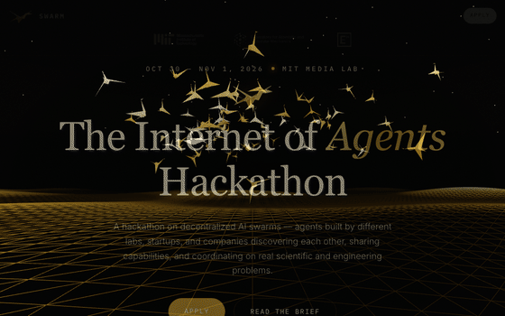

# INFINITE — Hackathon Demo

Static site for the **INFINITE: The Internet of Agents Hackathon**, MIT Media Lab, Oct 30 – Nov 1, 2026.

Three visual themes of the same hackathon page — pick the one you like, or use them side-by-side to A/B test the look.

## swarm — Black & gold (live)

The deployed build at [infinite-hackathon.vercel.app](https://infinite-hackathon.vercel.app). Features the improved origami crane model: puffed diamond torso, folded neck with beak, raised tail, and gap-free swept wings.



## v1 — Blue (synthwave)

Origami cranes over an ocean surface, dark blue + cyan. Original theme.


## v2 — Gold (black & gold variant)

Re-themed fork: glowing infinity logo, partner logos, layered tentacles/anemone effect that fades in as you scroll, same content and structure.


## Run

No build step. Any static file server works:

```bash
cd swarm   # or v1, v2
python3 -m http.server 8000
```

Then open `http://localhost:8000`.

The 3D scene pulls Three.js from jsDelivr CDN (`three@0.160.0`), so an internet connection is needed to render the background. Text and layout are fully local.

## Structure

- `swarm/` — live black & gold build (deployed at infinite-hackathon.vercel.app), improved crane model
- `v1/` — blue synthwave theme (original)
- `v2/` — black & gold theme (variant)

All themes share the same nav/sections/apply page and the same `js/main.js` interactions. Only the palette, hero logo treatment, and the canvas overlay effects differ.

## Notes

- Relative asset paths throughout, so each theme runs standalone at any static host.
- `prefers-reduced-motion` is respected: animations render one static frame only when the user requests reduced motion.
